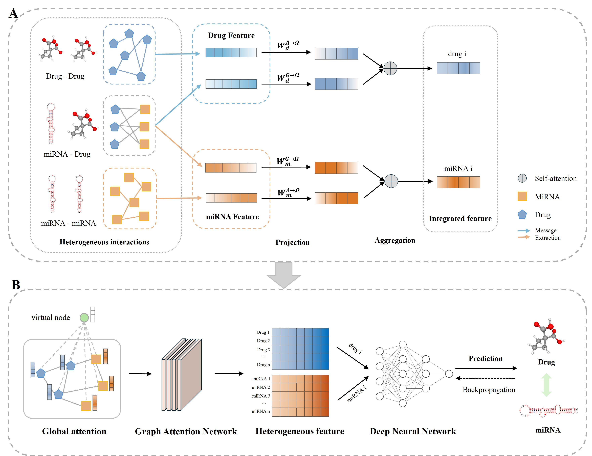

# HGGN

 HGGN, a specialized deep learning framework designed for predicting microRNA-mediated drug susceptibility. HGGN employs a miRNA-drug resistance heterogeneous network that integrates drug SMILES similarity and miRNA sequence similarity as inputs. It employs a dual-channel combination of Adamic-Adar and GIPKS to extract potential signals characterizing association relationships within the data. Additionally, it employs GAT to adaptively capture global network features and offer interpretability to the prediction outcomes. 


## Environment

The required environment has been packaged in the [`requirements.txt`](./requirements.txt) file.    
Please run the following command to install.

```commandline
cd HGGN
pip install requirements.txt
```

## Datasets

- miRNA-drug sensitivity data, miRNA sequence similarity data and drug SMILES similarity data are in the folder [`raw_data`](./raw_data/).
## Usage

NOTE: Please make sure the `dataset` already exists and run the [`data_prepare.py`](./data_prepare.py) file for preprocessing.
```commandline
cd HGGN
python .\main.py --data-dir ./data/  --fold 0  --num-epochs 2  --hid-r 128  --n-layers 4 --n-features 512 --learning-rate 0.0005
```

## Parameters

- `data-dir`: string, default `./data/`.  
  Dataset folder.
- `fold`: int in `[0, 1, 2, 3, 4]`.  
  The k-th fold in a 5-fold cross validation.
- `num-epochs`: int, default `200`.  
  Number of epochs to train.
- `hid-r`: int, default `128`.  
  Vector dimension of the hidden layer.
- `n-layers`: int, default `4`.  
  Number of layers of Graph attention network.
- `n-features`: int, default `512`.  
  Dimensions of feature projection.
- `learning-rate`: float between `[0, 1]`, default `5e-4`.  
  Learning rate.

## Interpretability pipline

- In the file [`explainer.ipynb`](./explainer.ipynb), we give an example of using `GNNExplainer` to explain HGGN.

